# AWS VPC & Networking Lab (DevOps Project)

## Project Overview

This project demonstrates how to build a secure cloud network architecture on AWS using a custom Virtual Private Cloud (VPC). It includes public and private subnets, Internet Gateway, NAT Gateway, EC2 instances, and routing configurations.

The goal is to simulate a real-world DevOps network setup used in production environments.

---

## Architecture Design

```text id="arch1"
Internet
   ↓
Internet Gateway
   ↓
Public Subnet (10.0.1.0/24)
   ↓
Public EC2 (Web Server + Bastion Host)
   ↓
Private Subnet (10.0.2.0/24)
   ↓
Private EC2 (No public access)
   ↓
NAT Gateway (Outbound internet access only)
```

---

## AWS Resources Used

* Custom VPC (10.0.0.0/16)
* Public Subnet (10.0.1.0/24)
* Private Subnet (10.0.2.0/24)
* Internet Gateway (IGW)
* NAT Gateway with Elastic IP
* Route Tables (Public & Private)
* Security Groups
* EC2 Instances (Amazon Linux 2023)

---

## Setup Steps

### 1. VPC Creation

Created a custom VPC:

```text id="vpc1"
10.0.0.0/16
```

---

### 2. Subnets

**Public Subnet**

```text id="sub1"
10.0.1.0/24
```

**Private Subnet**

```text id="sub2"
10.0.2.0/24
```

---

### 3. Internet Gateway

* Attached IGW to VPC
* Enables public internet access for public subnet

---

### 4. NAT Gateway

* Created in Public Subnet
* Assigned Elastic IP
* Provides internet access for Private Subnet

---

### 5. Route Tables

#### Public Route Table

```text id="rt1"
Destination → Target
10.0.0.0/16 → local
0.0.0.0/0 → Internet Gateway
```

#### Private Route Table

```text id="rt2"
Destination → Target
10.0.0.0/16 → local
0.0.0.0/0 → NAT Gateway
```

---

### 6. EC2 Instances

#### Public EC2 (Web + Bastion Host)

* Has Public IP
* Used for SSH access to private instance
* Runs Apache Web Server

#### Private EC2

* No public IP
* Accessible only via Public EC2 (Bastion Host)

---

## Security Groups

### Public EC2 Security Group (Public-SG)

* SSH (22) → My IP
* HTTP (80) → 0.0.0.0/0

### Private EC2 Access

* SSH (22) → Allowed from Public EC2 Security Group

---

## Web Server Setup

Apache installed on Public EC2:

```bash id="web1"
sudo yum install -y httpd
sudo systemctl start httpd
sudo systemctl enable httpd
echo "Hello from DevOps EC2" | sudo tee /var/www/html/index.html
```

---

## Connectivity Tests

### Public Web Access

```text id="test1"
http://13.60.203.173 → Working
```

### Private EC2 SSH Access

```text id="test2"
SSH via Public EC2 → Successful
```

### NAT Internet Access

```text id="test3"
ping google.com → Successful
```

---

## ⚠️ Issues Faced & Fixes

### ❌ Issue 1: SSH timeout to EC2

**Fix:** Correct route table association with public subnet

---

### ❌ Issue 2: Private EC2 had no internet

**Fix:** Added NAT Gateway route in private route table

---

### ❌ Issue 3: Website not loading

**Fix:** Used HTTP instead of HTTPS

---

## Screenshots
### VPC Overview
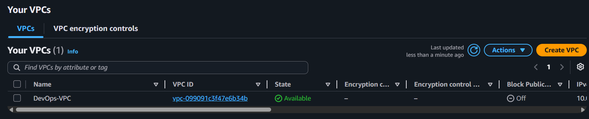

### CIDR Block
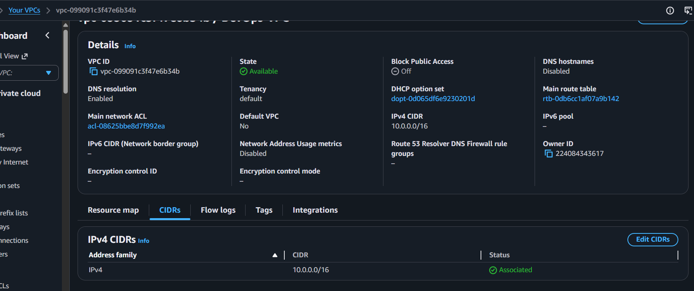

### Public Subnet & Private Subnet
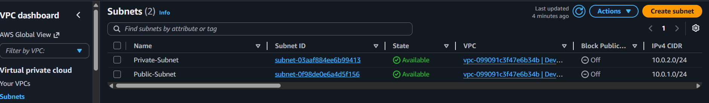

### Internet Gateway
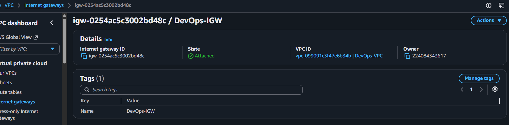

### NAT Gateway
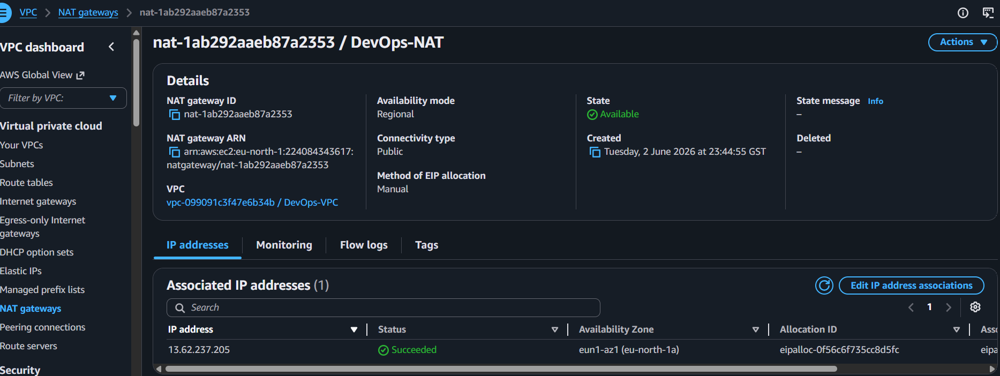

### Route Tables (Public & Private)
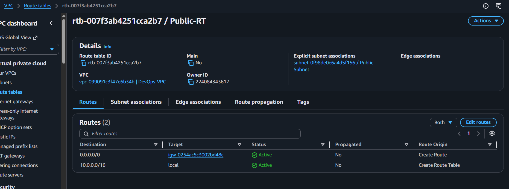
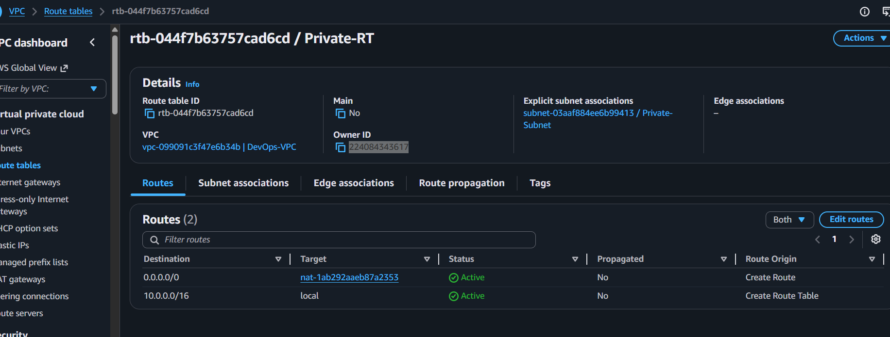

### Security Group
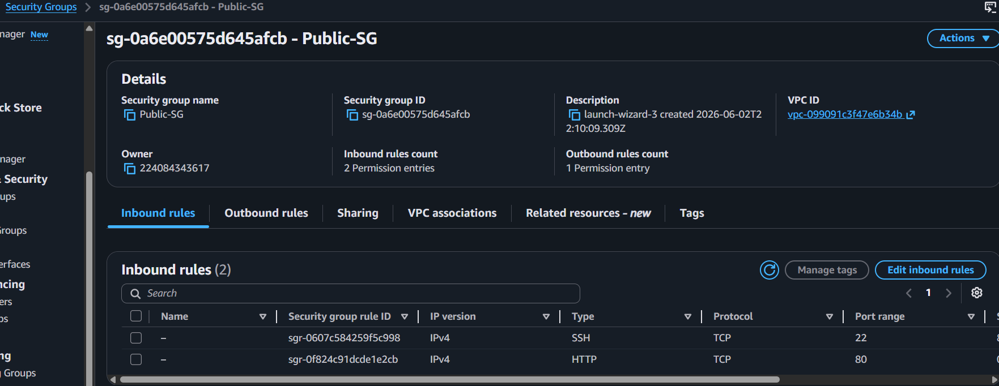

### EC2 Instance (Public)
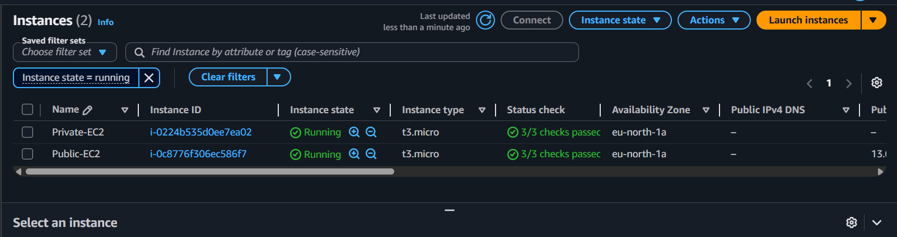

### SSH Public EC2
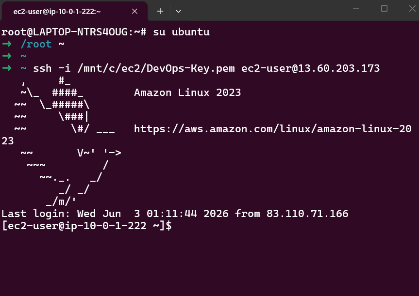

### SSH Private EC2 (Bastion Host)
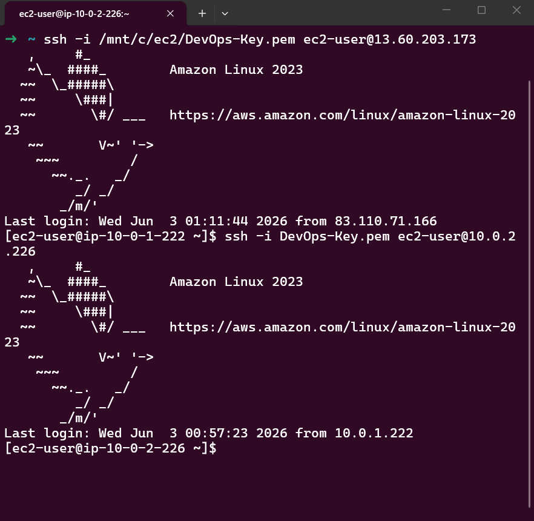

### Website Working (HTTP)
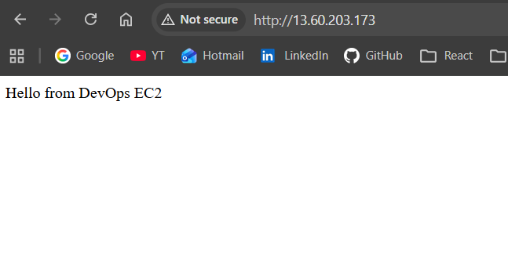

### Curl Test
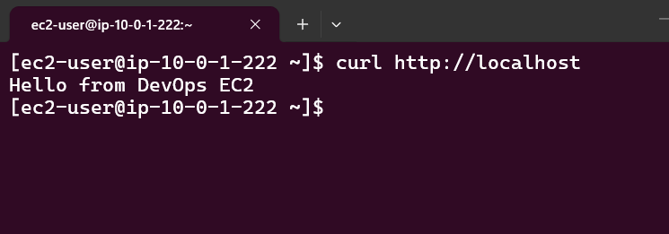

### Apache Running
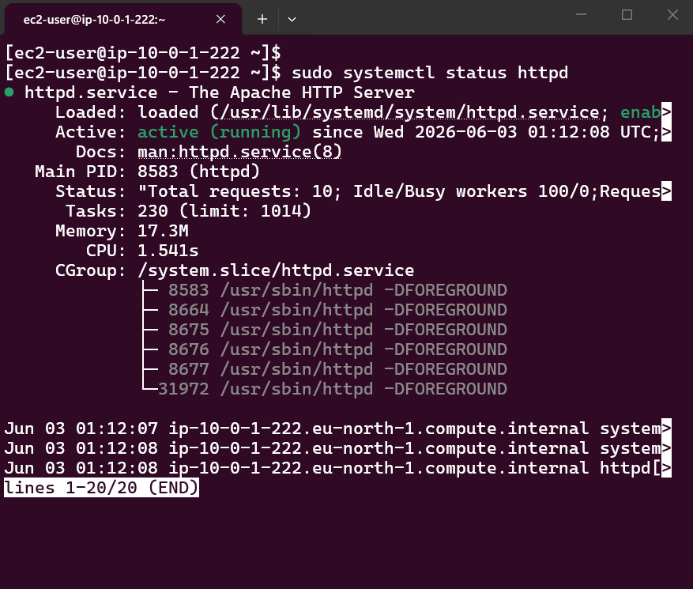

### NAT Internet Test
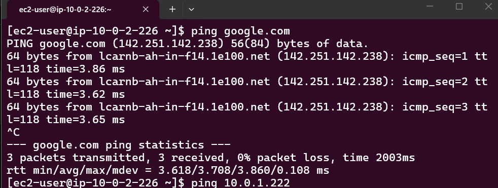

---

## Skills Demonstrated

* AWS VPC Design
* Subnetting (Public & Private)
* Internet Gateway & NAT Gateway
* Route Table Configuration
* Security Groups
* EC2 Administration
* Linux Web Server Setup
* Bastion Host Architecture
* Network Troubleshooting

---

## Author

Abdirahman Yusuf
DevOps Engineering Project

---

## Status

✔ Fully working AWS VPC architecture
✔ Public + Private subnet design
✔ NAT Gateway configured
✔ Web server deployed successfully
