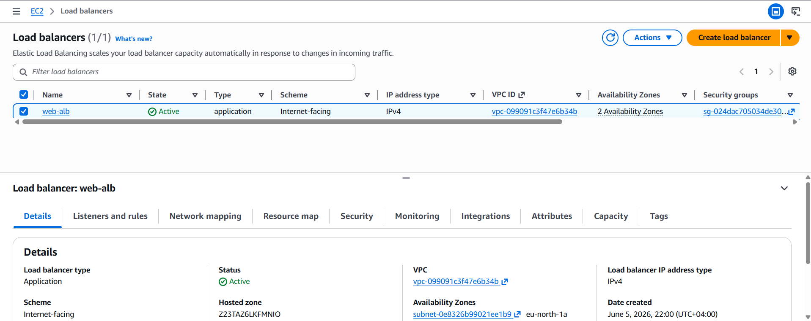
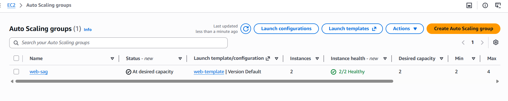
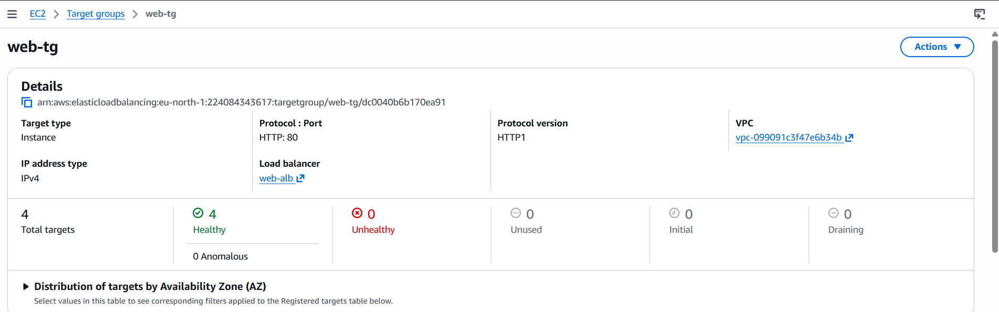
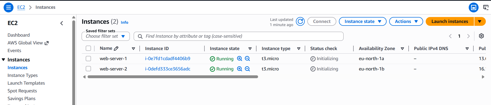

# AWS ALB + Auto Scaling Group Project

## Overview

This project demonstrates a highly available and scalable web application architecture using AWS services including:

- Amazon EC2
- Application Load Balancer (ALB)
- Auto Scaling Group (ASG)
- Target Groups
- Security Groups
- Route 53 (optional)
- AWS Certificate Manager (ACM)

---

## Architecture

```text
Internet User
      │
      ▼
Application Load Balancer
      │
      ▼
   Target Group
      │
      ▼
Auto Scaling Group
   ┌─────────┐
   │ EC2 #1  │
   │ EC2 #2  │
   └─────────┘
```
---

## AWS Services Used

### 1. Amazon EC2
- Amazon Linux 2023 instances
- Apache web server installed via user-data
- Auto-generated web content for testing load balancing

### 2. Application Load Balancer (ALB)
- Internet-facing ALB
- Routes traffic across multiple EC2 instances
- Performs health checks on `/` endpoint

### 3. Auto Scaling Group (ASG)
- Desired capacity: 2
- Minimum: 2
- Maximum: 4
- Automatically replaces unhealthy instances
- Ensures high availability across Availability Zones

- At times, the Auto Scaling Group showed **4 healthy instances instead of 2**
- This happened due to ASG behavior called **"launch before terminate"**
- During scaling or replacement events, ASG temporarily launches new instances first
  before terminating old ones to ensure zero downtime
- After stabilization, the group automatically returns to the desired capacity (2 instances)


### 4. Target Groups
- Registers EC2 instances
- Performs continuous health checks
- Ensures only healthy instances receive traffic

### 5. Security Groups
- ALB Security Group:
- Allows HTTP (80) from internet
- EC2 Security Group:
- Allows HTTP only from ALB security group

---

## Security Design

This project follows AWS security best practices:

- EC2 instances are **not publicly accessible**
- Only ALB is exposed to the internet
- Traffic flow is controlled via Security Groups
- Minimizes attack surface

---

## Automation (User Data)

Each EC2 instance is automatically configured using a bootstrap script:

- Installs Apache (httpd)
- Starts and enables service
- Deploys simple HTML page for testing

This ensures **zero manual configuration after launch**.

---

## Testing & Validation

### Load Balancing Test
- Accessed ALB DNS name in browser
- Refreshed multiple times
- Verified traffic distribution across instances

### Health Check Validation
- Target group confirms **2/2 healthy instances**
- Unhealthy instances are automatically replaced by ASG

---

## DNS & Route 53 (Optional Layer)

A Route 53 hosted zone was created for:

- Custom domain mapping to ALB via **Alias record**

### Limitation
- No real domain was purchased or publicly delegated
- DNS resolution works only within AWS lab environment
- Public internet access to custom domain was not fully enabled

---

## HTTPS (ACM Certificate)

- AWS Certificate Manager (ACM) certificate was requested
- DNS validation records were generated

### Limitation
- Certificate remained in **pending validation**
- Cause: No real domain delegation (required for ACM validation)
- HTTPS setup was not fully completed

---

## Challenges & Issues Resolved

### 1. Health Check Failures
- Instances initially showed as unhealthy
- Root cause: incorrect or missing user-data configuration
- Fix: corrected Apache installation script and redeployed instances

---

### 2. Launch Template Misconfiguration
- AMI was not selected initially
- Caused Auto Scaling Group failure
- Fix: recreated template with Amazon Linux 2023 AMI

---

### 3. Git Pre-commit Error
- `.pre-commit-config.yaml` missing caused commit failure
- Fix: bypassed hook using `--no-verify`

---

### 4. DNS Resolution Issue
- Route 53 records created but domain not publicly resolvable
- Cause: no external domain registration or delegation (e.g. Cloudflare or Route 53 registrar)

---

## Screenshots

### Application Load Balancer (ALB)


### Auto Scaling Group (ASG)


### Target Group Health Checks


### EC2 Instances


### Browser Test (ALB DNS)
[Watch Demo Video](screenshots/alb-demo.mp4)


---

## Key Learnings

- Designing scalable AWS architectures using ALB + ASG
- Importance of health checks in distributed systems
- Auto Scaling for fault tolerance and high availability
- Secure architecture design using layered security groups
- DNS and ACM require real domain ownership for production use
- Debugging AWS infrastructure issues in real environments

---

## Outcome

This project successfully demonstrates a **cloud-native, highly available web architecture** using AWS best practices.

It replicates a real-world production system capable of:

- Handling traffic distribution
- Auto-recovering from failures
- Scaling based on demand
- Operating across multiple Availability Zones

---

**DevOps AWS Project (Portfolio Lab)**  