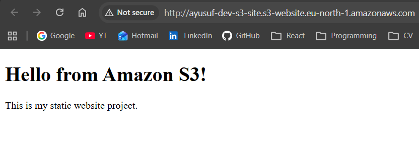
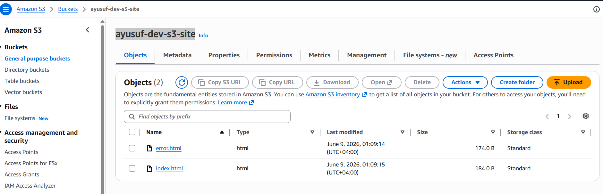
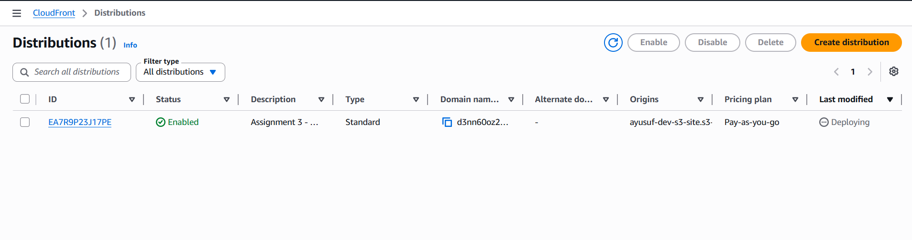
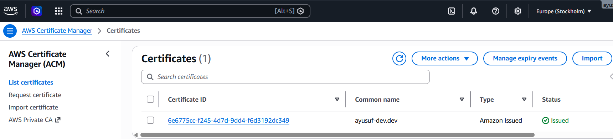
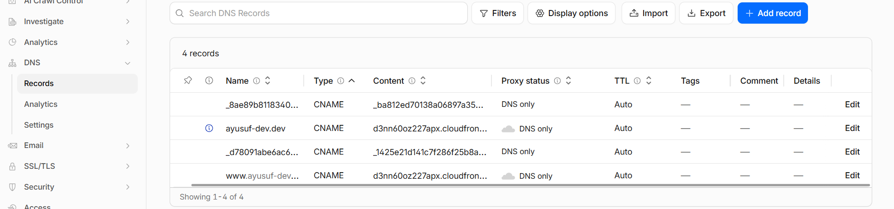
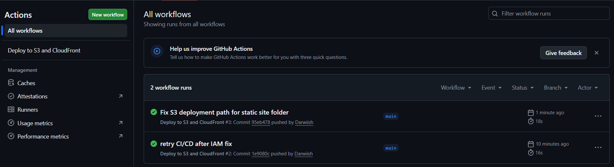
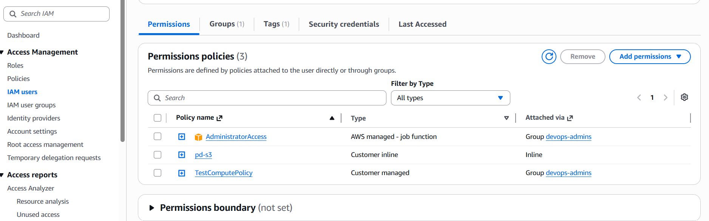
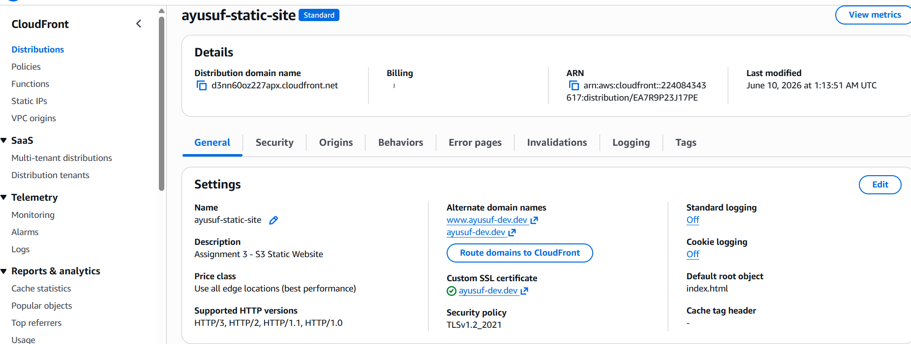
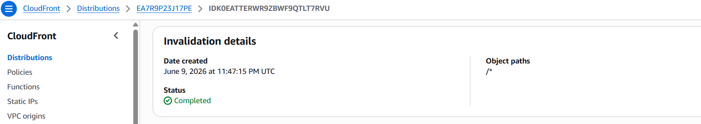
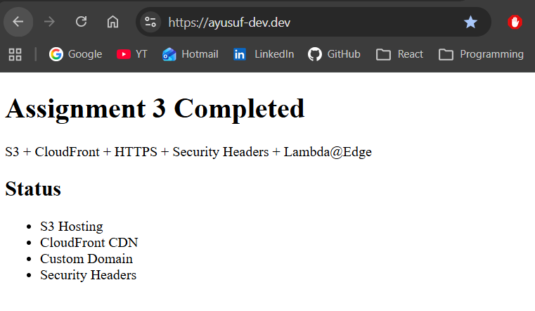

# Assignment 3 - S3 Static Website + CloudFront CDN + Custom Domain

## Overview

This project demonstrates a secure and globally distributed static website architecture using AWS services including:

* Amazon S3
* Amazon CloudFront
* AWS Certificate Manager (ACM)
* Cloudflare DNS
* GitHub Actions CI/CD

The solution hosts a static website in Amazon S3, distributes content globally through CloudFront, secures traffic using HTTPS with ACM certificates, and automates deployments using GitHub Actions.

---

## Architecture

```text
Internet
   ↓
Cloudflare DNS
   ↓
CloudFront CDN
   ↓
Amazon S3 Static Website
```

---

## AWS Services Used

### 1. Amazon S3

* Static website hosting
* Stores website files (`index.html`, `error.html`)
* Highly durable and scalable object storage
* Acts as the origin for CloudFront
* Stores website content securely and reliably

### 2. Amazon CloudFront

* Global Content Delivery Network (CDN)
* Caches content at edge locations worldwide
* Improves website performance and reduces latency
* Reduces load on the S3 origin
* Enforces HTTPS connections
* Provides secure content delivery

### 3. AWS Certificate Manager (ACM)

* SSL/TLS certificate management
* Provides HTTPS encryption
* Integrated directly with CloudFront
* Supports automatic certificate validation and renewal
* Secures communication between users and the website

### 4. Cloudflare DNS

* Custom domain management
* DNS records configured to point domain traffic to CloudFront
* Simplifies domain routing and management
* Provides reliable DNS resolution

### 5. GitHub Actions CI/CD

* Automated deployment workflow
* Deploys website files to Amazon S3
* Automatically invalidates CloudFront cache
* Eliminates manual deployments
* Enables rapid and reliable website updates

Deployment Flow:

```text
Git Push
   ↓
GitHub Actions
   ↓
Amazon S3
   ↓
CloudFront Cache Invalidation
   ↓
Live Website
```

---

## Repository Structure

```text
assignment-3-s3-static-website-cloudfront-cdn/
├── README.md
├── index.html
├── error.html
└── screenshots/
```

---

## Implementation Steps

### Step 1 - Create S3 Bucket

Created an S3 bucket:

```text
ayusuf-dev-s3-site
```

Configured:

* Static website hosting
* Bucket permissions
* Index document:

```text
index.html
```

* Error document:

```text
error.html
```

Uploaded website files:

```text
index.html
error.html
```

---

### Step 2 - Create CloudFront Distribution

Configured CloudFront with:

* S3 bucket as origin
* Redirect HTTP to HTTPS
* Default root object:

```text
index.html
```

* Cache policy:

```text
CachingOptimized
```

CloudFront Distribution URL:

```text
https://d3nn60oz227apx.cloudfront.net
```

---

### Step 3 - Configure ACM Certificate

Requested ACM certificate in:

```text
us-east-1
```

Domains:

```text
ayusuf-dev.dev
www.ayusuf-dev.dev
```

Validation method:

```text
DNS Validation
```

Added validation CNAME records in Cloudflare.

Certificate status:

```text
Issued
```

---

### Step 4 - Configure Cloudflare DNS

Added DNS records pointing the domain to CloudFront.

Custom domain:

```text
https://ayusuf-dev.dev
```

Configured:

* DNS records
* SSL certificate integration
* CloudFront alternate domain names

Verified successful DNS resolution.

---

### Step 5 - Configure GitHub Actions CI/CD

Created workflow:

```text
.github/workflows/deploy.yml
```

Workflow tasks:

* Trigger on push to main branch
* Upload files to S3
* Invalidate CloudFront cache
* Deploy website automatically

Workflow Flow:

```text
Developer Push
        ↓
GitHub Repository
        ↓
GitHub Actions
        ↓
AWS IAM User
        ↓
Amazon S3
        ↓
CloudFront Invalidation
        ↓
Production Website
```

---

## Security Design

This project follows AWS security best practices:

* HTTPS enforced across all website traffic
* SSL/TLS certificate managed through ACM
* Content delivered through CloudFront CDN
* DNS managed through Cloudflare
* CloudFront configured to redirect HTTP to HTTPS
* CI/CD uses dedicated IAM credentials
* Automated deployments reduce manual errors

---

## Testing & Validation

### Static Website Validation

* Uploaded website files to S3
* Verified successful website rendering through CloudFront

### CloudFront Validation

Verified:

* CloudFront distribution deployed successfully
* Content served from edge locations
* CDN URL accessible

### HTTPS Validation

Verified:

* ACM certificate successfully issued
* CloudFront distribution using certificate
* Browser displays secure HTTPS connection

### CI/CD Validation

Validation process:

1. Modified website content
2. Committed changes
3. Pushed changes to GitHub
4. GitHub Actions triggered automatically
5. Files deployed to S3
6. CloudFront cache invalidated
7. Updated website visible in browser

Result:

```text
Deployment Successful
```

---

## Custom Domain Configuration

Custom domain:

```text
https://ayusuf-dev.dev
```

Configured using:

* Cloudflare DNS
* CloudFront Distribution
* AWS Certificate Manager

---

## Challenges & Issues Resolved

### 1. ACM Certificate Validation

**Issue**

Certificate remained in Pending Validation state.

**Root Cause**

DNS validation records were not configured correctly.

**Resolution**

* Added ACM validation CNAME records to Cloudflare
* Waited for DNS propagation
* Certificate successfully issued

---

### 2. Custom Domain Not Resolving

**Issue**

```text
https://ayusuf-dev.dev
```

did not load.

**Root Cause**

DNS records were not pointing correctly to CloudFront.

**Resolution**

* Updated Cloudflare DNS records
* Verified domain resolution
* Confirmed HTTPS access through CloudFront

---

### 3. GitHub Actions Authentication Issue

**Issue**

Git operations failed during repository configuration.

**Root Cause**

GitHub authentication and SSH configuration issues.

**Resolution**

* Generated SSH key
* Added public key to GitHub
* Updated Git remote URL to SSH
* Verified successful authentication

Verification:

```bash
ssh -T git@github.com
```

---

### 4. IAM Permission Error

**Issue**

Deployment failed with:

```text
AccessDenied
s3:ListBucket
```

**Root Cause**

GitHub Actions IAM user lacked required permissions.

**Resolution**

* Updated IAM permissions
* Added required S3 access
* Re-ran workflow successfully

---

### 5. S3 Deployment Path Issue

**Issue**

CloudFront returned:

```text
NoSuchKey: index.html
```

**Root Cause**

The workflow deployed the wrong directory.

Repository structure:

```text
aws-devops-projects/
├── assignment-1-vpc-networking/
├── assignment-2-application-load-balancer/
└── assignment-3-s3-static-website-cloudfront-cdn/
```

Original deployment path:

```text
.
```

Correct deployment path:

```text
assignment-3-s3-static-website-cloudfront-cdn/
```

**Resolution**

* Updated GitHub Actions workflow
* Redeployed website
* Verified successful website access

---

### 6. CloudFront Caching Issue

**Issue**

Website updates were not immediately visible.

**Root Cause**

CloudFront cached previous content.

**Resolution**

* Added CloudFront invalidation to deployment workflow
* Verified updated content appears after each deployment

---
## Screenshots

### S3 Static Website Hosting



### S3 Website Files



### CloudFront Distribution



### ACM Certificate



### Cloudflare DNS Records



### GitHub Actions Workflow



### GitHub Actions Deployment Success


### IAM User Permissions



### CloudFront Distribution Settings



### CloudFront Cache Invalidation



### Live Website



---

## Key Learnings

* Hosting static websites using Amazon S3
* Using CloudFront as a global CDN
* Implementing HTTPS with AWS Certificate Manager
* Configuring custom domains with Cloudflare DNS
* Automating deployments using GitHub Actions
* Managing IAM permissions for CI/CD pipelines
* Troubleshooting CloudFront caching issues
* Debugging deployment path issues
* Understanding CDN-based content delivery
* Integrating multiple AWS services into a production-style architecture

---

## Outcome

This project successfully demonstrates a secure, scalable, and globally distributed static website architecture using AWS best practices.

It replicates a real-world production system capable of:

* Hosting static content globally
* Delivering content through a CDN
* Enforcing HTTPS encryption
* Using a custom domain
* Automating deployments through CI/CD
* Providing scalable and highly available content delivery

The final solution provides:

* Amazon S3 Static Website Hosting
* Amazon CloudFront CDN
* HTTPS via AWS Certificate Manager
* Cloudflare DNS Integration
* GitHub Actions CI/CD Automation
* Automatic CloudFront Cache Invalidation

---

**DevOps AWS Project (Portfolio Lab)**
